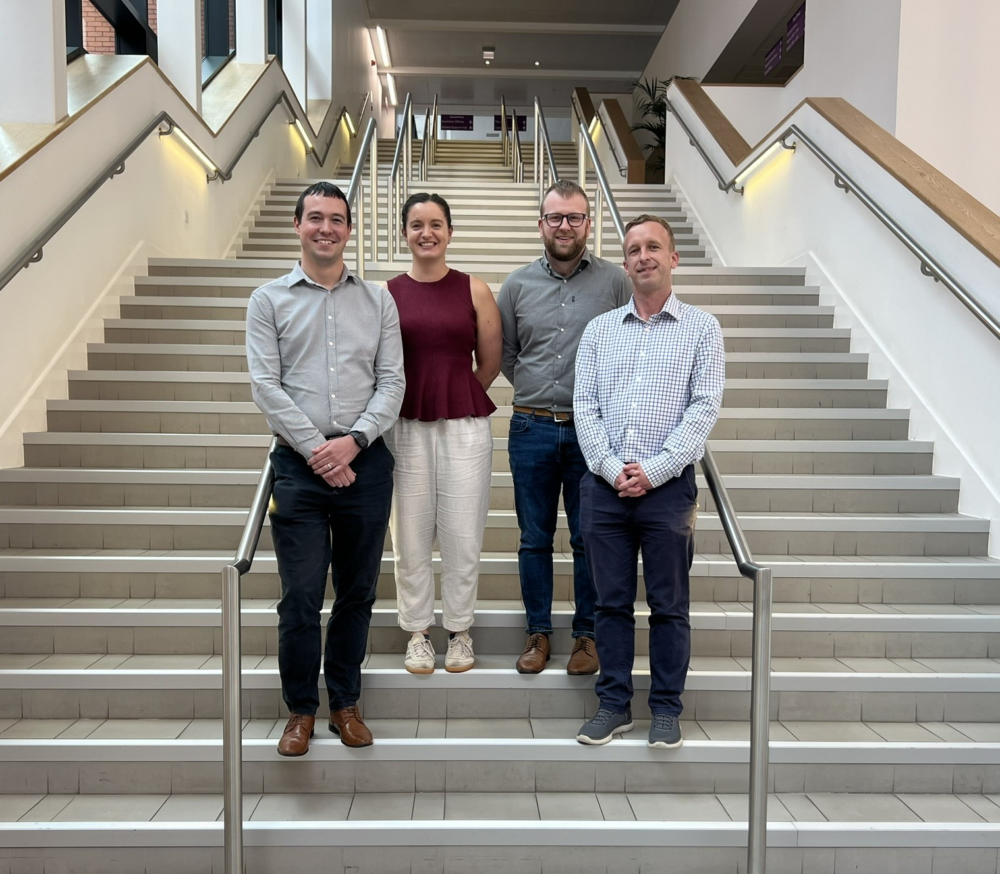
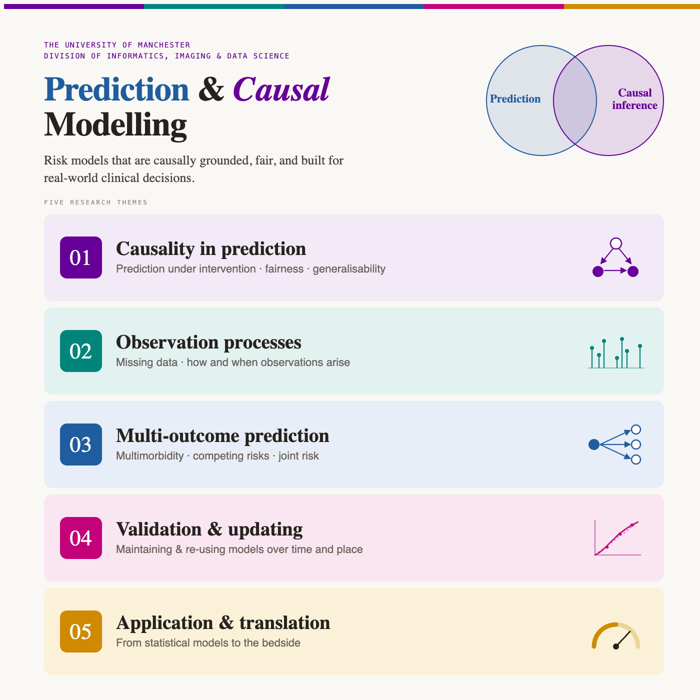
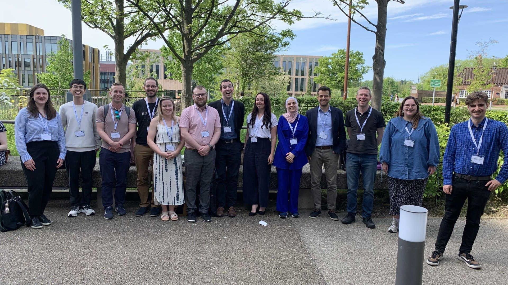

The Prediction Modelling and Causal Inference research group (aka One Prediction) is based within the [Division of Informatics, Imaging and Data Sciences](https://research.manchester.ac.uk/en/organisations/division-of-informatics-imaging-data-sciences/) at the University of Manchester. The group is led by Professor Matthew Sperrin, Dr Glen Martin, Dr David Jenkins, and Dr Siân Bladon. 

{height="6in"}

The group's research is focused around clinical prediction modelling and causal inference. There are 5 main themes which are summarised in the graphic below. 

{height="6in"}

There are currently around 22 members of the group, including pre-doctoral fellows, PhD students, post-doc research associates and research fellows. The members page has more information about each person in the group, including their publications. 

{height="6in"}

## What's happening recently

:::{#news-listing}
:::
