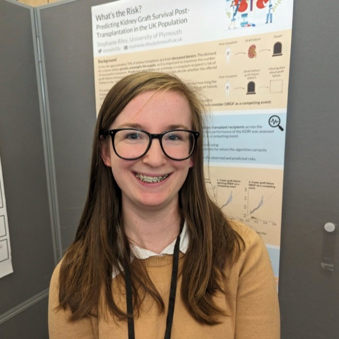
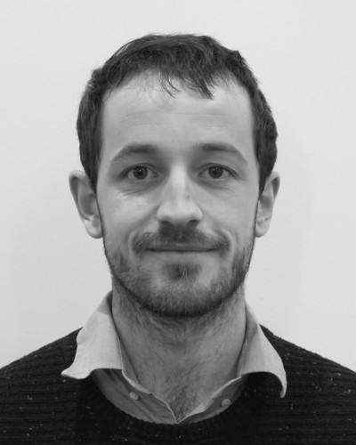

To celebrate Post-Doc Appreciation Week 2026 we are shining a spotlight on some of the fantastic PDRAs we have working in the group!

## Steph Riley - PDRA

{height="3in"}

My research interests sit at the intersection of statistics, causality, and healthcare. My work largely focuses on generalisability and transportability. One aspect of this is extrapolating findings from randomised controlled trials to broader populations, helping to bridge the gap between trial and real-world evidence. Another focuses on prediction models and ensuring they remain accurate and useful once deployed in the healthcare system. 

A common theme across my research is an interest in where methods are useful in practice. Recently, this interest has led me to explore researchers’ attitudes towards applying causal inference methods, and the barriers to their wider adoption in healthcare research.

One of the things I enjoy most about my job is being part of this research group. The group creates a great environment for learning and collaboration, with both a supportive and fun vibe. There is always someone around for a chat, whether that’s to talk through your research, think through a problem, or just a catch up over coffee. 

## Alex Pate - Research Fellow

{height="3in"}

I work on multi-outcome prediction, model evaluation and model stability. I think more time should be spent translating methods into practice, and therefore I am maintaining R packages to help support people working with routinely collected data, and evaluating the performance of multi-state models. I like working in the One Prediction group because of the fabulous people and impactful work.